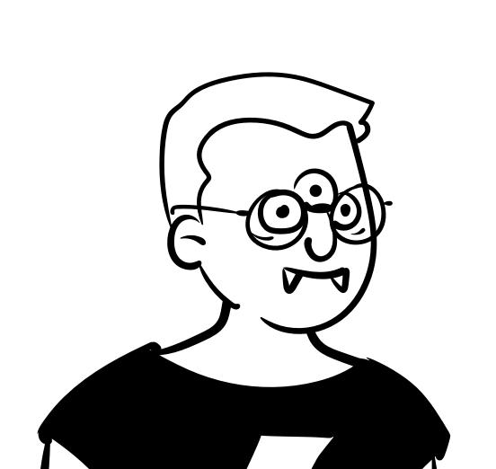

# 🦉 Owl.io

<div align="center">
  


**Uma landing page moderna e interativa desenvolvida com AngularJS, Bootstrap e animações elegantes**

[]()
[]()
[]()
[]()
[]()

</div>

---

## 📋 Sobre o Projeto

**Owl.io** é uma landing page demonstrativa desenvolvida com tecnologias frontend clássicas (2022). AngularJS com validação de formulários reativa, Gulp.js para build automation, SCSS pré-processamento, minificação de assets (CSS/JS), e animações on-scroll com ScrollReveal. Projeto educacional demonstrando domínio de task runners e pré-processadores CSS.

### ✨ Características

- 🎨 **Design Moderno**: Interface clean com ilustrações personalizadas
- 📱 **Totalmente Responsivo**: Adaptável para desktop, tablet e mobile
- ⚡ **Animações Suaves**: Efeitos de scroll reveal e transições elegantes
- 🎵 **Integração Spotify**: Player embutido na página
- 🔧 **Otimização com Gulp**: Minificação automática de CSS e JS

---

## 🚀 Tecnologias Utilizadas

### Frontend
- **HTML5** - Estrutura semântica
- **CSS3/SCSS** - Estilização com preprocessador
- **JavaScript (ES6+)** - Funcionalidades interativas
- **AngularJS** - Framework JavaScript para SPAs
- **Bootstrap 5** - Framework CSS responsivo
- **jQuery** - Manipulação do DOM

### Bibliotecas e Plugins
- **ScrollReveal** - Animações ao scroll
- **Box Icons** - Ícones vetoriais
- **Google Fonts** - Tipografias (Bebas Neue, Lora, Roboto)

### Ferramentas de Build
- **Gulp** - Automação de tarefas
- **gulp-clean-css** - Minificação de CSS
- **gulp-uglify** - Minificação de JavaScript
- **gulp-imagemin** - Otimização de imagens

---

## 📦 Estrutura do Projeto

```
Projeto_Owl/
│
├── assets/
│   ├── css/
│   │   ├── style.scss          # Estilos principais (SCSS)
│   │   ├── style.css           # Estilos compilados
│   │   └── style.min.css       # Estilos minificados
│   │
│   ├── js/
│   │   ├── main.js             # JavaScript principal
│   │   ├── main.min.js         # JavaScript minificado
│   │   └── angular/
│   │       ├── app.js          # Módulo principal AngularJS
│   │       └── controller/
│   │           ├── cadastroCtrl.js  # Controller de cadastro
│   │           ├── logarCtrl.js     # Controller de login
│   │           └── consulta.js      # Controller de consultas
│   │
│   ├── img/
│   │   ├── ilustracoes/        # Ilustrações da página
│   │   └── perfis/             # Fotos de perfil
│   │
│   └── lib/                    # Bibliotecas externas
│       ├── angular/
│       ├── bootstrap/
│       ├── jquery/
│       └── scrollReveal/
│
├── views/
│   ├── nav.html                # Barra de navegação
│   ├── header.html             # Cabeçalho com login
│   ├── footer.html             # Rodapé com links sociais
│   └── modal/
│       └── cadastro.html       # Modal de cadastro
│
├── index.html                  # Página principal
├── gulpfile.js                 # Configuração do Gulp
├── package.json                # Dependências do projeto
└── README.md                   # Este arquivo
```

---

## 🛠️ Instalação e Uso

### Pré-requisitos

- Node.js (v12 ou superior)
- npm ou yarn

### Passo a Passo

1. **Clone o repositório**
```bash
git clone https://github.com/LuanCalais/Projeto_Owl.git
cd Projeto_Owl
```

2. **Instale as dependências**
```bash
npm install
```

3. **Execute o Gulp para minificação** (opcional)
```bash
npm install -g gulp-cli
gulp minify-css
gulp minify-js
```

---

## 🎯 Funcionalidades

### 🎨 Animações e Efeitos
- **ScrollReveal**: Elementos aparecem suavemente ao fazer scroll
- **Animação de ondas**: Efeito CSS animado na seção final
- **Scrollbar customizada**: Design personalizado para a barra de rolagem

### 📱 Design Responsivo
- Layout adaptável para diferentes tamanhos de tela
- Oculta elementos específicos em mobile (classe `d-none d-md-none d-lg-block`)
- Grid system do Bootstrap para organização

---

## 🎨 Paleta de Cores

| Cor | Hex | Uso |
|-----|-----|-----|
| Preto | `#000000` | Background principal, ícones |
| Branco | `#FFFFFF` | Texto, cards |
| Cinza Escuro | `#292923` | Scrollbar |
| Cinza Claro | `#919191` | Texto secundário |

---

<div align="center">

**Feito por Luan Calais**

</div>